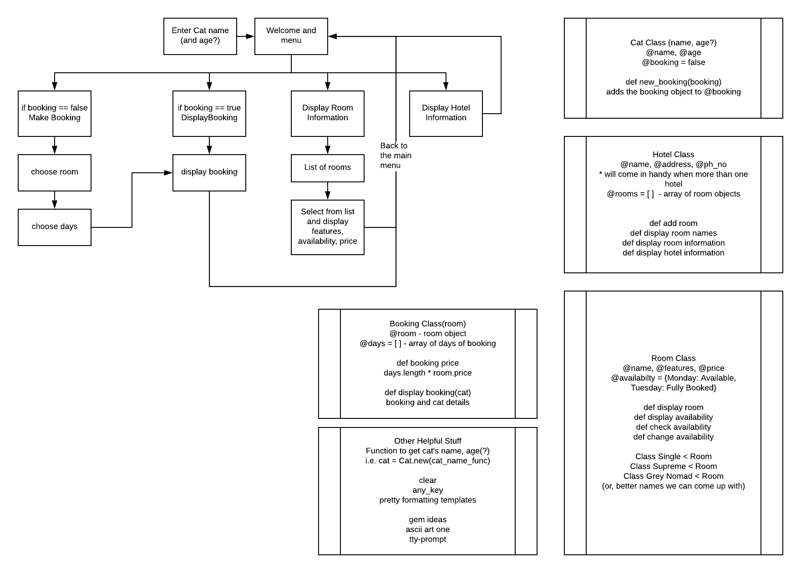
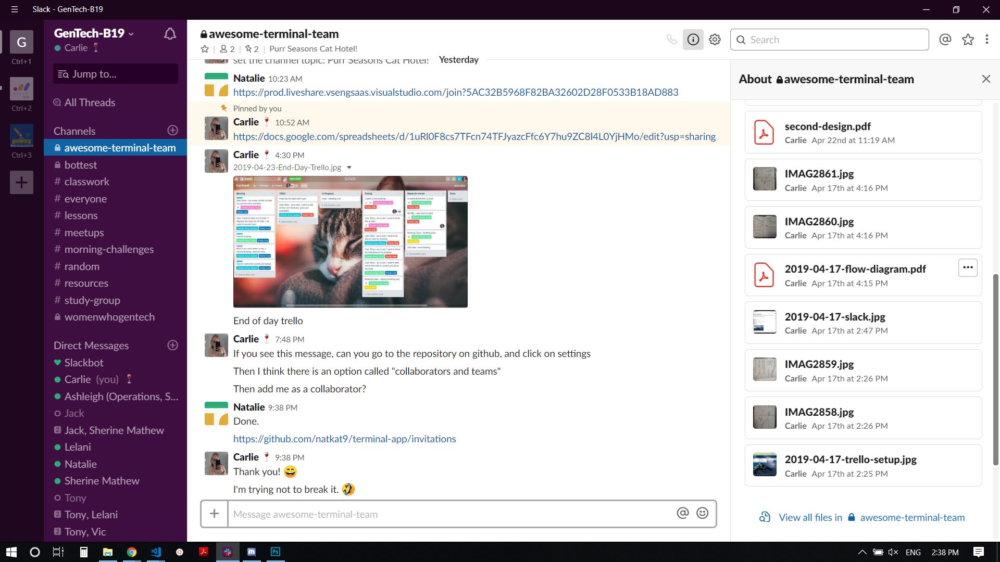
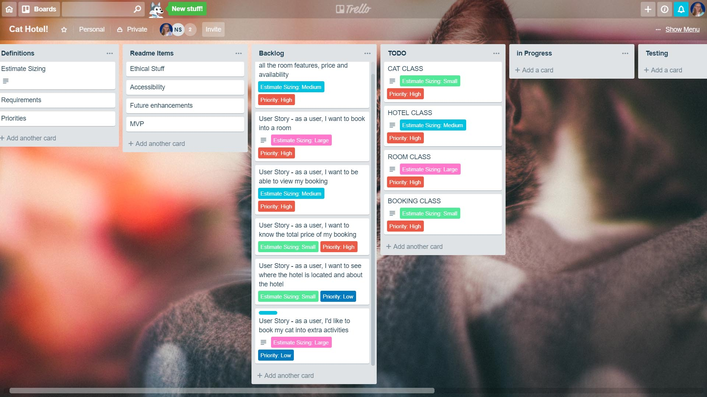
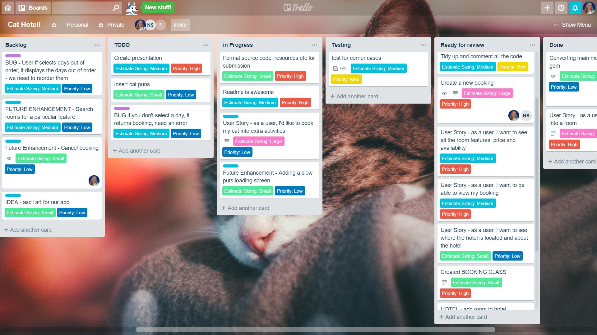

# PURR SEASONS

## Ruby Terminal App

by Carlie Hamilton and Natalie Sargent

## Link to Github

Link to the repository - [https://github.com/natkat9/terminal-app](https://github.com/natkat9/terminal-app "Our Github Repository")

## About the App

### Description & Purpose

This app is a MVP of a Cat Hotel Booking System for the Purr Seasons Cat Hotel. The app allows a user to book a hotel stay and extra activities for their cat, in a 7 day period.

The user can create a booking for their cat by choosing a room type and the days that they would like to book their cat in. They can also choose extra activities to book their cat into. 

The user is able to look at the different room types and activities, and see additional information for each. They are also able to see the details of the hotel, such as the contact information and a little bit about the hotel. 

Once the user has created a booking they are able to see the booking that they created, including the total price of the room and activities they selected. 

### Functionality

On commencing the application, the user is prompted to enter their cat's name and from there they are presented with a menu prompt where they can select to make a new booking, view an existing booking, view room types, view activities, view information about the hotel, or to exit the app.

When making a new booking the user is given the option to select one of 3 room types.  They are then prompted to select what days they would like to stay, from the available days.  The booking is created and displayed for the user.  The user is then prompted to press any key to return to the main menu.

If the user has created a booking they can select to view an existing booking, and their booking will be displayed.  Otherwise, they are advised that they do not yet have a booking and they will be prompted to return to the main menu.

View room types ...

View activities ...

View hotel information ...

Exit ...

### Instructions for Installation and Use

1. You will need ruby installed on your computer. [Download ruby here](https://www.ruby-lang.org/en/).
2. You will also need the Bundler gem installed. It comes with the main ruby installation, but if you do not have it on your machine, you can install it with the following command: 

`gem install bundler`

3. Fork or clone this repository down to your local computer
4. To install the gem(s) required, navigate to the location of this repostitory on your computer and use the command:

`bundle install`

5. Run the app with:

`ruby main.rb`

## Design & Planning process

When planning this application, we brainstormed a couple of ideas. We decided to settle on the Cat Hotel Booking System as we felt that we could be creative with it. 

### Initial Flow Chart

This was our initial flow chart and structure ideas for app.

Link to our testing spreadsheet - 

Challenges

Talk about github and trello

### Project plan & timeline

#### Day 1

We worked together with pair programming to create the basic structure of the app. We utilized a gem TTY-Prompt for the menus so that our user can easily select multiple items at once. As we went along we tested our app with each new feature. 

#### Day 2

In the morning we worked on finalising the functionality of the app as well as commenting, the look of the app, and cleaning up code. We implemented a stretch goal to include activities to book into. 

In the afternoon we worked on documentation for the app.

#### Collaboration

We used VS Code Live Share to work together. We commited to git regularly to back up our code. We also had a slack channel to communicate together. 

#### Trello

We used Trello to organise what we needed to do. We had user stories to drive what features we needed to implement. We used custom fields to estimate the sizing (how long a feature would take) as well as the priority of the feature. We had labels for future enhancement ideas (stretch goals) as well as for any bugs we encountered. 

Below are some examples of our Trello board at various points in our development.

Day 1 

Day 2

### Code Structure

- `main.rb` is the main document that controls the flow of the program.

- `classes/hotel.rb` holds the Hotel class. This class holds the information of the hotel, such as the address and phone number. It also holds a list of the rooms in the hotel, and the activities associated with the hotel. It is used for methods that show the rooms and activities all together. 

- `classes/room.rb` holds the Room super class, as well as it's sub classes (which are different types of rooms). This class deals with methods that pertain to a room, such as showing the availability of a room.

- `classes/cat.rb` holds the cat class. The cat class has the details of the cat as well as a booking that is associated with the cat when it (the booking) is created. The booking is initialized with the cat as "nil" - this is used during the main flow of the program, as different menus show different things depending on if there is a booking or not. 

- `classes/booking.rb` is initialized once the user has selected a room and days. Activities can been added to the booking optionally. It displays the booking and it also calculates the total price of the booking. 

- `classes/activity.rb` is similar to the room class, but instead holds different activities that can optionally be added to the booking. The individual activities are sub classes to the main activity super class. 

- `methods/headers.rb` is a file that holds some methods to make the main flow of the program look pretty. 

#### Gem 💎 TTY-Prompt

We chose to use the TTY-Prompt gem, as this cuts out user error when accessing the menus. The user can not input incorrect information, but instead selects from a list.

One difficulty with using this gem is we had to change our data (such as a room's availability that is stored in a hash) to a format that the menu recognizes.  We believe that it is worth this extra step in the code, as we do not have to worry about incorrect user input, it makes navigating the application easier, and also because the menu is formatted nicely.

It is recommended to use a font that supports unicode for this gem to look extra pretty.

#### Corner Cases

Some of the corner cases we encountered include:

- If the cat name is accidently not given, we implimented a loop so that the user has the opportunity to write in the cat's name. 

#### Future Extentions

The code has been designed to be modular and DRY as possible, with thought toward how the app could be modified in the future. 

Some possible future implementations include:

* Currently the app does not save the booking in any way. We would implement saving the booking and also sending a copy of the booking to the user's email.
* A user will be able to log in with a password, store all their bookings and see past bookings.
* The user will be able to pay for the booking using a credit card. 
* Allow the user to booking into more than just one week but any date for any amount of time. 
* Allow the app to accept multiple cats, and multiple bookings.
* Get the cat's age and recommend certain rooms or activities based on their age. 
* Allow the user to enter information regarding special considerations for their cat, for example if their cat has any behavioural, medical or dietary concerns.
* Style the colours of the app using the gem [pastel](https://github.com/piotrmurach/pastel)

### Accessibility

The app has clear instructions for screen readers, however to make the app more accessible to the vision impaired we could implement a text-to-speech gem in the future.  

The TTY-Prompt gem has made the app more accessable for a command line interface, as the user doesn't have to type in their desired choice. This also makes it harder for the user to input an incorrect response that may bring up an error.  

### Potential Ethical, Legal and Broader Societal Implications

In a future extensions we will have to consider the legal and ethical ramifications of storing user data and taking money online from the user. If this was a business they would also have to consider having a disclaimer that the user would agree to with the conditions of making a booking and using the app. 

The hotel must consider the safety and wellbeing of their cat guests.  In a future extension, we would add the facility for user to record any special needs requests, for example if their cat has any medical, dietary or behavioural concerns that the hotel may need to accommodate.

- Comprehensive discussion of possible social, political, cultural, racial, gender and international issues
